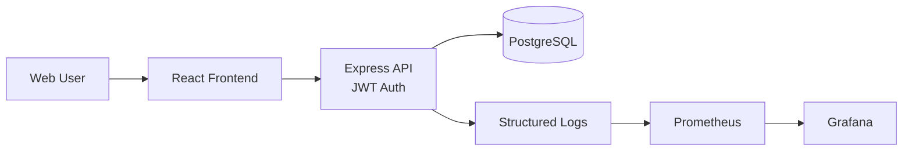

# Three-Tier Multi-Cloud DevOps Application

Author: Sandeep Kumar Prasad

A production-style 3-tier application for managing user authentication and task workflows, built with React, Express, and PostgreSQL, and designed to run locally with Docker Compose while remaining deployable to AWS, Azure, and GCP via Kubernetes, Helm, and Terraform.

## Overview

This project demonstrates a complete full-stack delivery setup with:

- Frontend: React + Vite
- Backend: Node.js + Express + JWT authentication
- Database: PostgreSQL
- Local runtime: Docker Compose
- Cloud runtime: EKS, AKS, and GKE-ready manifests
- IaC: Terraform for infrastructure provisioning
- Orchestration: Kubernetes and Helm
- CI/CD: GitHub Actions workflows
- Observability: Prometheus and Grafana
- Security: secret handling guidance, scanning, and least-privilege deployment patterns

## Architecture



## Features

- User registration and login flow with JWT-based auth
- Protected task management APIs
- CRUD task functionality in the UI
- Health check endpoints for validation
- Local PostgreSQL development setup
- Dockerized local stack for quick startup
- Kubernetes and Helm deployment templates
- Terraform plans for multi-cloud provisioning
- CI/CD workflow scaffolding for GitHub Actions

## Tech stack

### Frontend
- React 18
- Vite
- Testing Library + Vitest

### Backend
- Node.js 20+
- Express
- PostgreSQL client and pg-mem for tests
- JWT and bcrypt
- Jest + Supertest

### Infrastructure
- Docker Compose
- Kubernetes manifests
- Helm chart
- Terraform modules
- Prometheus + Grafana monitoring

## Quick start

### Prerequisites

- Node.js 20+
- npm 10+
- Docker Desktop or Docker Engine with Compose enabled

### 1) Install dependencies

```bash
npm install --workspaces
```

### 2) Run locally with Docker

```bash
npm run docker:up
```

Then access:

- Frontend: http://localhost:5173
- Backend: http://localhost:5000
- Health check: http://localhost:5000/health
- API base: http://localhost:5000/api/v1

### 3) Run without Docker

Frontend:

```bash
cd frontend
npm install
npm run dev
```

Backend:

```bash
cd backend
npm install
NODE_ENV=development USE_PG_MEM=true node src/server.js
```

## Project structure

```text
three-tier-multicloud-devops/
├── .github/                  # CI/CD workflows
├── backend/                  # Express API and auth service
├── database/                 # Schema and migration files
├── docs/                     # Architecture and design notes
├── frontend/                 # React + Vite application
├── helm/                     # Helm chart for deployment
├── kubernetes/               # Kubernetes manifests and overlays
├── monitoring/               # Prometheus and Grafana config
├── scripts/                  # Utility scripts
├── terraform/                # Multi-cloud infrastructure as code
├── tests/                    # Integration and verification assets
├── .env.example              # Example environment variables
├── .gitignore
├── docker-compose.yml        # Local full-stack composition
├── Makefile                  # Common repo commands
├── package.json              # Root workspace configuration
├── README.md
└── package-lock.json
```

## Environment variables

Copy the example file before running the stack:

```bash
cp .env.example .env
```

Update the values for your local or deployment environment. Keep secrets out of source control and prefer managed secret storage in production.

## Validation

Run the project checks from the repo root:

```bash
npm run test:frontend
npm run test:backend
npm run build
```

For the backend in local test mode:

```bash
cd backend
NODE_ENV=test USE_PG_MEM=true npx jest --runInBand --detectOpenHandles
```

## Deployment notes

### Kubernetes and Helm

```bash
kubectl apply -k kubernetes/overlays/aws
helm install taskflow ./helm/three-tier-app -f ./helm/three-tier-app/values-aws.yaml
```

### Terraform

```bash
cd terraform/aws
terraform init
terraform validate
terraform plan
terraform apply
```

Supported clouds:
- AWS
- Azure
- GCP

## Security and operations

- JWTs used for secure API auth
- Secrets stored outside source control
- Docker and infrastructure scans prepared via CI workflows
- Container and IaC scanning paths included in the repo structure
- Least-privilege policies and managed secrets recommended for production deployment

## Troubleshooting

### Docker Compose fails to start

Ensure Docker Desktop or the Docker engine is running and that the daemon is available on your host.

### Frontend cannot reach backend

Verify that `VITE_API_BASE_URL` matches your backend base URL and that the API is running.

### PostgreSQL fails to initialize

Check that the port is free and volume state is not corrupted.

## Cleanup

```bash
docker compose down -v
```

## Future improvements

- OpenTelemetry tracing
- Redis caching layer
- S3 artifact storage
- Playwright end-to-end tests
- Helm chart testing
- GitOps deployment flow with ArgoCD or Flux

## License

This project is provided as a starter/learning repository and is intended for educational and prototyping use. Update the license terms to match your organization or deployment requirements before using it in production.
